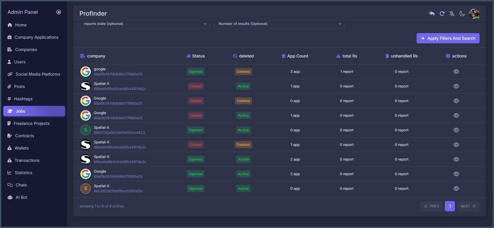

   

    

# **ProFinder** 🌟

**ProFinder** is a platform that connects professionals with clients to create valuable work opportunities. 🤝 Whether you're seeking freelance gigs, looking to hire experts, or aiming to collaborate with professionals, ProFinder offers a robust system that ensures the rights of both parties. 💼🔍 The app provides a powerful mechanism for secure transactions 🔒, a comprehensive search for companies 🏢, and a way to enhance your profile by sharing your CV 📄 to increase job opportunities. It also features a beautiful and eye-catching design that makes navigation easy and enjoyable. 🌟 Start using ProFinder today to unlock new possibilities! ✨

## Product Links 🛒

- **Web App🖥️🖥️ :** [**Click Here to Visit My Dashboard Live!**](https://profinder-dashboard.web.app) 🚀
- **Screenshots🖼️ :** [**View Screenshots**](https://profinder-screens.vercel.app/)
- **Android App📱 :** [**Download on Telegram**](https://t.me/profinder_mobile_app/3)

# Dashboard Overview 🛠️

The Admin Dashboard is the central hub for managing the platform, providing both Admins and Super Admins with comprehensive tools to oversee and maintain the application's operations.

## Roles and Responsibilities

### 1. Super Admin 👑

- **Admin Management:** Super Admins have the ultimate authority to create, delete, or modify Admin permissions, ensuring that the right people have access to the right tools.
- **Complete Oversight:** With full control over the platform, Super Admins can manage every aspect of the system, from user activities to financial transactions, ensuring a seamless and secure operation.

### 2. Admin 🛠️

- **User Management:** Admins are equipped to search, filter, delete, or ban users based on their behavior, maintaining a safe and compliant environment.
- **Content Moderation:** Admins monitor user reports and other activities, ensuring all content meets the platform's standards.
- **Specialized Admin Levels:**
  - **Wallet Manager 💳:** Oversees all financial transactions, ensuring secure and accurate processing of payments and withdrawals.
  - **Company Manager 🏢:** Manages company-related activities, including the creation, verification, and moderation of company accounts and job postings.
  - **Freelancer Manager 👨‍💼:** Focuses on freelance projects, ensuring smooth interactions between freelancers and clients, and addressing any issues that arise.
  - **Technical Support 🛠️:** Provides assistance for technical issues, troubleshooting problems, and responding to user inquiries.

## Key Dashboard Features

### User Management

- **Search & Filter:** Easily find users through advanced search and filtering options.
- **Ban/Suspend Users:** Enforce platform rules by banning or suspending users who violate terms.
- **Monitor User Activity:** Keep track of user interactions and content, ensuring compliance with guidelines.

### Company Management

- **Approve or Reject Companies:** Review company creation requests and verify documentation to maintain platform integrity.
- **Manage Company Profiles:** Edit or update company details as needed.

### Freelance Project Management

- **Oversee Projects:** Monitor all freelance projects, ensuring they meet quality standards.
- **Resolve Disputes:** Intervene in case of conflicts between freelancers and clients, providing a fair resolution.

### Financial Controls

- **Transaction Monitoring:** View and verify all financial transactions, ensuring they are legitimate and secure.
- **Suspend Funds:** Temporarily hold funds if suspicious activity is detected, protecting both users and the platform.

### Contract Management

- **Manage Contracts:** Oversee and approve contracts between users, ensuring they meet the platform’s standards.
- **Review Terms:** Ensure that contract terms are fair and clearly understood by all parties involved.

### Wallets

- **Manage Wallets:** Administer user wallets, including adding funds, processing withdrawals, and ensuring secure transactions.
- **Transaction History:** Provide users with detailed transaction histories to maintain transparency.

### Posts Management

- **Oversee Content:** Monitor and manage posts to ensure they comply with community guidelines.
- **Handle Reports:** Process user reports regarding inappropriate content or companies, and take appropriate action.

### Technical Support Chat

- **User Support:** Provide assistance to users via an integrated support chat, helping them resolve issues efficiently.
- **Admin Collaboration:** Facilitate communication between admins and users to address technical problems, feedback, or queries.

## Comprehensive Reporting and Analytics

### Statistics and Analytics

- **Track Key Metrics:** Monitor user engagement, popular content, and overall platform usage to make informed strategic decisions.
- **Analyze Performance:** Review performance metrics to identify trends and areas for improvement.

### Generate Reports

- **Detailed Reporting:** Create comprehensive reports on various aspects of platform operations.
- **Informed Decisions:** Use generated reports to support data-driven decision-making and enhance platform management.

## Report Processing

### User Reports

- **Efficient Processing:** Handle user-submitted reports concerning companies, posts, or other users effectively.
- **Prompt Resolution:** Ensure timely and fair resolution of user reports to maintain platform integrity.

### Investigate & Act

- **Investigate Issues:** Thoroughly investigate reported issues to determine the appropriate course of action.
- **Take Action:** Implement necessary measures, such as issuing warnings, suspending accounts, or removing content, to address reported concerns and uphold platform standards.

## **Tools & Technologies** 🔧🌐

| **Purpose**                   | **Tool/Technology**                                                                                                                                               |
| ----------------------------- | ----------------------------------------------------------------------------------------------------------------------------------------------------------------- |
| **JavaScript Library**        |                                      |
| **CSS Framework**             |               |
| **State Management**          |              |
| **Routing**                   |              |
| **Animation Library**         |         |
| **Data Fetching and Caching** |  |
| **Data Visualization**        |                           |

## **Developers**

| **Name**                                                      | **Role**           | **Technology** | **Linked In**                                                        | **Email**               |
| ------------------------------------------------------------- | ------------------ | -------------- | -------------------------------------------------------------------- | ----------------------- |
| **[Me: Osama Saddik](https://github.com/osamasaddik)**        | Frontend Developer | React.js       | [@Osama-Saddik](https://www.linkedin.com/in/osama-saddik-8b814b259)  | saddikosama@gmail.com   |
| **[Ayman Al-khatib](https://github.com/Ayman-Al-Khatib)**     | Backend Developer  | Express.js     | [@Ayman-Al-Khatib](https://www.linkedin.com/in/ayman-al-khatib)      | ayman.eng.job@gmail.com |
| **[Ahmad Ajajeh](https://github.com/Ahmad-Ajajeh)**           | Backend Developer  | Express.js     | [@Ahmad-Ajajeh](https://www.linkedin.com/in/ahmed-ajajeh-b999b6175/) | ajajeh356@gmail.com     |
| **[Ahmed Nour Haidar](https://github.com/Ahmad-Nour-Haidar)** | Mobile Developer   | Flutter        | [@Ahmed-Nour-Haider](https://www.linkedin.com/in/ahmad-nour-haidar/) | example.email@gmail.com |
| **[Omar Bkdash](https://github.com/Omar-Bkdash-7)**           | Mobile Developer   | Flutter        | [@Omar-Bkdash](https://www.linkedin.com/in/omar-bkdashh)             | example.email@gmail.com |
| **Alaa Haidar**                                               | UI & UX Designer   | Figma          | [@Alaa-Haidar](https://www.linkedin.com/in/alaa-haidar)              | alaahaidaar@gmail.com   |

# Screenshots

The **Admin Dashboard** provides a web interface to manage user activities and edit content. Below are screenshots showing its light and dark modes for admins.

    
    
    
    
    
    
    
    
    
    
    
    
    
    
    
    
    
    
    
    
    
    
    
    
    
    
    
    
    
    
    
    
    
    
    
    
    
    
    
    
    
    
    
    
    
    
    
    
    
    
    
    
    
    
    
    
    
    
    
    
    
    
    
    
    
    
    
    

---

Below are new screenshots from the **Super Admin** Dashboard section. Only unique screens that are not already featured in the Admin Dashboard are included.

     
     
     
     
     
     

